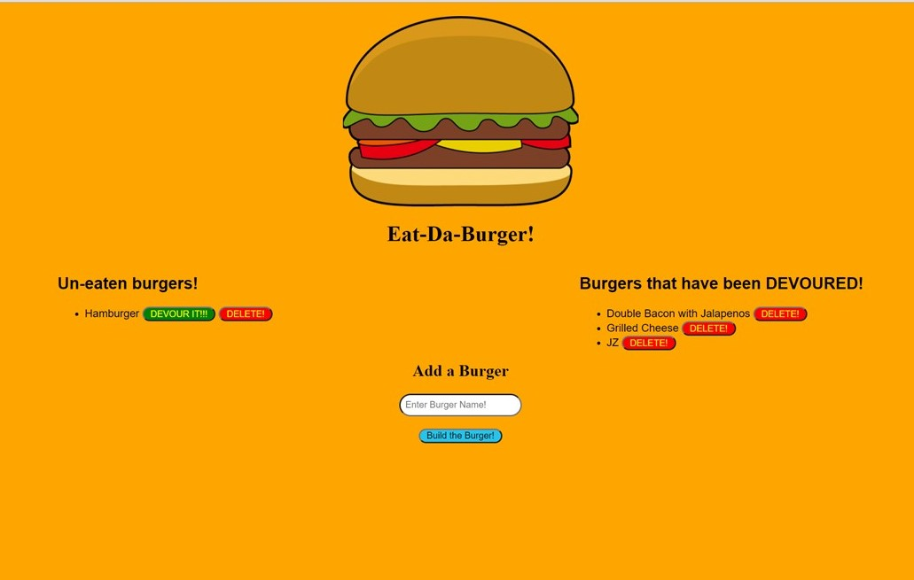

# Burger Logger

App: https://yummy-burger-logger.herokuapp.com/

## Description
As a Full-Stack Developer, I have created an application that will allow me to devour the burgers I have added. I have created this application to utilize the MVC design pattern. In order to achieve this, I will use Node and MySQL to query and route data in the application, and Handlebars to generate the HTML.

## Table of Contents

* [Title](#Title)
* [Description](#Description)
* [Usage](#Usage)

## Usage
Enter your own burger that you would like to eat, or click "DEVOUR IT" to eat that burger and see the magic!

## Questions
Coreyburkett22@gmail.com

